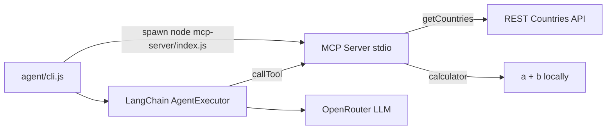

# Lab 13 — MCP stdio + LangChain CLI Agent

Example of **MCP over stdio**: the LangChain agent spawns the MCP server as a child process and communicates via stdin/stdout (JSON-RPC). No HTTP server required.

## Architecture



Unlike Lab 11 (Streamable HTTP), the client **does not connect to a URL**. `StdioClientTransport` launches the server process and pipes messages over stdio.

## Quick start

One-time setup (from the repo root):

```bash
cd lab_13/mcp-server
npm install

cd ../agent
npm install
cp .env.example .env
# Edit .env and set OPENROUTER_API_KEY=your-key-here
```

Run the agent (from `lab_13/agent`). The MCP server is spawned automatically — you do **not** need a separate terminal for it.

```bash
cd lab_13/agent

# Verify MCP tools (no API key needed)
npm run chat -- --list-tools

# Single question — countries
npm run chat -- --message "What is the capital of France and its population?"

# Single question — calculator
npm run chat -- --message "What is 123 plus 456?"

# Interactive chat
npm run chat -- -i
```

Optional — run the MCP server alone (debugging / MCP inspector only):

```bash
cd lab_13/mcp-server
node index.js
# stdout is MCP protocol only — do not print to stdout
```

## MCP Tools

| Tool | Description |
|------|-------------|
| `getCountries` | Fetch countries from [GeoDB](https://wirefreethought.com/geodb-api) + [CountriesNow](https://countriesnow.space). Optional filters: `name`, `region`. |
| `calculator` | Receive two numbers `a` and `b`, return their sum. |

Each agent run spawns a fresh MCP server child process and closes it when finished.

## How stdio works

1. **Agent CLI** calls `StdioClientTransport({ command: "node", args: ["../mcp-server/index.js"] })`.
2. **MCP SDK** spawns the server as a subprocess.
3. **Server** uses `StdioServerTransport` — reads JSON-RPC from stdin, writes responses to stdout.
4. **stderr** is used for server logs (stdout must stay clean for the protocol).
5. **LangChain** tools wrap `client.callTool()` so the LLM can invoke `getCountries` and `calculator`.

## Environment (`agent/.env`)

| Variable | Default | Description |
|----------|---------|-------------|
| `OPENROUTER_API_KEY` | — | Required. OpenRouter API key |
| `OPENROUTER_MODEL` | `openai/gpt-4o-mini` | LLM for the agent |
| `MCP_SERVER_SCRIPT` | `../mcp-server/index.js` | Path to MCP stdio entry script |
| `VERBOSE` | — | Set to `1` for LangChain verbose logging |

## Sample prompts

- "List countries in Europe"
- "Tell me about Japan — capital, region, and population"
- "What is 99.5 plus 0.5?"
- "Add 1000000 and 2500000"

## File layout

```
lab_13/
├── readme.md
├── mcp-server/
│   ├── index.js                 # stdio entry point
│   ├── create-tools-server.js   # getCountries + calculator
│   └── package.json
└── agent/
    ├── cli.js                   # command-line interface
    ├── agents/tools-agent.js    # LangChain agent
    ├── lib/mcp-client.js        # StdioClientTransport + tool bridge
    ├── .env.example
    └── package.json
```
