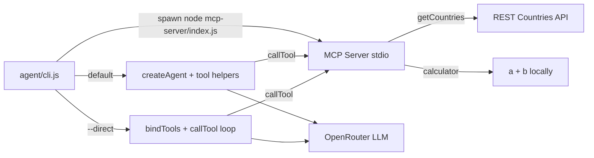

# Lab 14 — MCP stdio + LangChain `createAgent`

Same MCP setup as Lab 13, with two agent patterns:

1. **Default (`createAgent`)** — uses LangChain's `createAgent` with explicit `tool()` helpers that call `client.callTool()` for each MCP tool.
2. **Direct (`--direct`)** — no LangChain tool wrapper; the model is bound to MCP tool schemas and the agent loop calls `client.callTool()` directly.

## Architecture



## Lab 13 vs Lab 14

| | Lab 13 | Lab 14 (default) | Lab 14 (`--direct`) |
|---|--------|------------------|---------------------|
| Agent API | `createToolCallingAgent` + `AgentExecutor` | `createAgent` | Manual loop + `bindTools` |
| Tool bridge | Generic `DynamicStructuredTool` wrapper | Explicit `tool()` per MCP tool | No wrapper — direct `callTool` |
| MCP transport | stdio | stdio | stdio |

## Quick start

One-time setup (from the repo root):

```bash
cd lab_14/mcp-server
npm install

cd ../agent
npm install
cp .env.example .env
# Edit .env and set OPENROUTER_API_KEY=your-key-here
```

Run the agent (from `lab_14/agent`). The MCP server is spawned automatically.

```bash
cd lab_14/agent

# Verify MCP tools (no API key needed)
npm run chat -- --list-tools

# Default — createAgent + tool() helpers
npm run chat -- --message "What is the capital of France and its population?"

# Direct — bindTools + client.callTool()
npm run chat -- --direct --message "What is 123 plus 456?"

# Interactive chat (add --direct for the alternative mode)
npm run chat -- -i
npm run chat -- --direct -i
```

Optional — run the MCP server alone (debugging / MCP inspector only):

```bash
cd lab_14/mcp-server
node index.js
# stdout is MCP protocol only — do not print to stdout
```

## MCP Tools

| Tool | Description |
|------|-------------|
| `getCountries` | Fetch countries from [GeoDB](https://wirefreethought.com/geodb-api) + [CountriesNow](https://countriesnow.space). Optional filters: `name`, `region`. |
| `calculator` | Receive two numbers `a` and `b`, return their sum. |

Each agent run spawns a fresh MCP server child process and closes it when finished.

## Agent modes

### Default: `createAgent` + explicit tools

`agents/tools-agent.js` defines one `tool()` per MCP tool. Each helper calls `mcpClient.callTool({ name, arguments })` directly — no generic schema-to-wrapper factory.

```javascript
const agent = createAgent({
  model: createModel(),
  tools: [getCountries, calculator],
  systemPrompt: SYSTEM_PROMPT,
});
```

### Alternative: direct `callTool` (no wrapper)

`agents/direct-tools-agent.js` binds MCP tool schemas to the LLM with `bindTools`, then runs a small loop:

1. Model returns `tool_calls`
2. Agent calls `client.callTool({ name, arguments })`
3. Results are appended as `ToolMessage`
4. Loop until the model responds without tool calls

Use `--direct` on the CLI to try this mode.

## Environment (`agent/.env`)

| Variable | Default | Description |
|----------|---------|-------------|
| `OPENROUTER_API_KEY` | — | Required. OpenRouter API key |
| `OPENROUTER_MODEL` | `openai/gpt-4o-mini` | LLM for the agent |
| `MCP_SERVER_SCRIPT` | `../mcp-server/index.js` | Path to MCP stdio entry script |
| `VERBOSE` | — | Set to `1` for extra CLI logging |

## Sample prompts

- "List countries in Europe"
- "Tell me about Japan — capital, region, and population"
- "What is 99.5 plus 0.5?"
- "Add 1000000 and 2500000"

## File layout

```
lab_14/
├── readme.md
├── mcp-server/
│   ├── index.js
│   ├── create-tools-server.js
│   └── package.json
└── agent/
    ├── cli.js
    ├── agents/
    │   ├── tools-agent.js         # createAgent + tool() helpers
    │   └── direct-tools-agent.js  # bindTools + direct callTool loop
    ├── lib/
    │   ├── mcp-client.js          # stdio MCP connection (no LangChain wrapper)
    │   └── agent-utils.js         # model, prompts, message helpers
    ├── .env.example
    └── package.json
```
