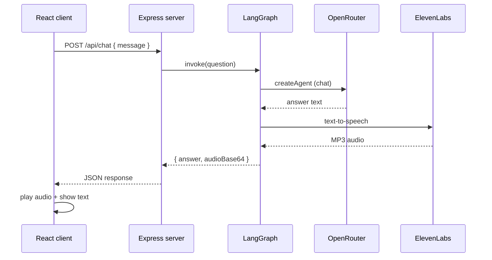

# Lab 38 — Voice Chatbot

React chat UI + Node.js API with a **LangGraph** workflow: OpenRouter LLM agent → **ElevenLabs** text-to-speech → voice reply in the browser.

## Architecture



**LangGraph nodes:** `chatAgent` → `elevenLabsTts`

## Prerequisites

- Node.js 20+
- [OpenRouter API key](https://openrouter.ai/keys)
- [ElevenLabs API key](https://elevenlabs.io/)

## Setup

### Server

```bash
cd server
cp .env.example .env
# Edit .env — set OPENROUTER_API_KEY and ELEVENLABS_API_KEY
npm install
npm run dev
```

Server runs on **http://localhost:3001**.

### Client

```bash
cd client
npm install
npm run dev
```

Client runs on **http://localhost:5173** (proxies `/api` to the server).

## Environment variables

| Variable | Required | Default |
|----------|----------|---------|
| `OPENROUTER_API_KEY` | Yes | — |
| `OPENROUTER_MODEL` | No | `openai/gpt-4o-mini` |
| `ELEVENLABS_API_KEY` | Yes | — |
| `ELEVENLABS_VOICE_ID` | No | `21m00Tcm4TlvDq8ikWAM` |
| `ELEVENLABS_MODEL_ID` | No | `eleven_multilingual_v2` |
| `PORT` | No | `3001` |

## Tests

```bash
cd server
npm test
```

## Project layout

```
lab_38_voice_chatbot/
├── client/          React + Vite chatbot UI
└── server/
    ├── src/agents/       createAgent + OpenRouter
    ├── src/graph/        LangGraph orchestration
    ├── src/services/     ElevenLabs TTS (Axios)
    └── test/             Mocha integration tests
```
